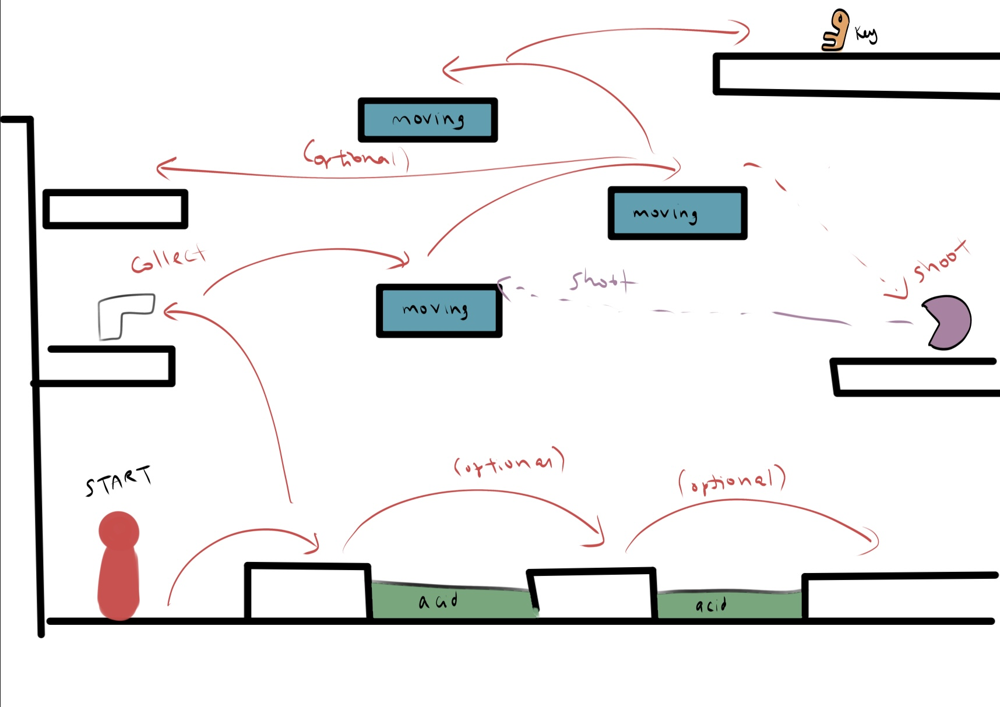

# COMP2150  - Level Design Document
### Name: Cecilia Tran
### Student number: 47878983

Word Count : 1529

## 1. Player Experience (~700 words)
Outline and justify how your level design facilitates the core player experience goals outlined in the assignment spec. Each section should be supported by specific examples and screenshots of your game encounters that highlight design choices made to facilitate that particular experience.

### 1.1. Discovery
What does the player learn? How does your encounter and broader level design facilitate learning in a way that follows good design practice?

In my initial layout for the level design, the map was set up in a way where it would be easy for new players to understand the basic setup of the game, and get used to the easier mechanics before it started to progress into a harder stage. Each level would bring a new mechanic / obstacle that the player would need to pass in order to progress, so by the time they reached the third level, they would know how to bypass each obstacle to reach the door. 

The first level would introduce acid, spitters, moving platforms and the gun weapon. This would give the player an opportunity to learn how to move around, use the weapons to defeat the spitter, and to figure out how to navigate the platforms. There would still be a risk which is the spitter and the acid.

The second level would introduce the staff weapon, checkpoints, chompers, spikes and disappearing platforms. By attempting to get through the second level, the player should be able to navigated all game mechanics to be able to complete the third level. 

*Introductory level 1*

### 1.2. Drama
What is the intensity curve? How does your design facilitate increasing yet modulating intensity, with moments of tension and relief? 

The general layout of the level designs was that it started off easy and relatively easy going, with the most dramatic section being the end of level three. The format of level one is relatively straightforward and small, as it is an introduction level and doesn’t need to be so complicated. 

As the player begins to figure out how the game works and what they need to be able to navigate each level, the game begins to become more intense after the first, with the third being the level with the most intensity as it is not only the most challenging level, but it contains more game mechanics compared to the other two. 

The third level contains more enemies for starters, which would make the game more dramatic for the player as there are higher risks of losing health. Furthermore, the variety of both moving platforms and fading platforms cluttered right before the final door would also create a sense of urgency for the player.

### 1.3. Challenge
What are the main challenges? How have you designed and balanced these challenges to control the difficulty curve and keep the player in the flow channel?

The main challenges in the game would be both the enemies, or the risk of falling into a danger zone after failing a jump. This can be seen especially in the last level, where there are more risky jumps and enemies scattered around compared to the previous two levels. 

The first level has low risk, as the acid puddles aren’t too difficult to navigate over, and the gun is close to the spawn point, which means that they can easily take out the spitter on the other side. The second level has an increased difficulty as there are fading platforms, and taking too long on them would risk falling into a spike pit. 

Compared to those two levels, the third level has the most risk, which makes it the most challenging. The addition of two health spawns placed before the start of the third level, as well as the spawn point, would aid the player in completing the level as it may be difficult to get through the entire game and complete the third level in one go.

Due to the layout of each stage and the obstacles planned for each one, the difficulty level and challenge would become more intense as the player progresses through the game. 

*Obstacle clutter in level 3*

### 1.4. Exploration
How does your level design facilitate autonomy and invite the player to explore? How do your aesthetic and layout choices create distinct and memorable spaces and/or places?

Each level of the floor is distinct and unique, meaning the player doesn't have to look at the same scenery for the entire game. By doing this, it adds a bit of interest, and changes in game aesthetic. The multiple routes that the player can take also adds to exploration, as it gives the player some more freedom and not have to stick to a set path.

Adding multiple routes also means that the player gets to explore the map a bit more, rather than have to stick to whatver they see on the screen and blindly follow a set path.

*Alternate passage to collect heart in level 2*

## 2. Core Gameplay (~400 words)
A section on Core Gameplay, where storyboards are used to outline how you introduce the player to each of the required gameplay elements in the first section of the game. Storyboards should follow the format provided in lectures.

Storyboards can be combined when multiple mechanics are introduced within a single encounter. Each section should include a sentence or two to briefly justify why you chose to introduce the mechanic/s to the player in that sequence.

You should restructure the headings below to match the order they appear in your level.

### 2.1. Acid

The acid is located at the start, a few steps away from where the player starts the game. There are two puddles of acid right away, so that the players have a chance to understand the basic mechanics of the game.

### 2.10. Weapon Pickup (Gun)

The gun pickup is located on the platform above the starting point, which makes it easy to access. This is so that the player can take out the enemy on the first level easily. 

### 2.6. Moving Platforms

The first moving platforms are located on the first level, and are placed in a way that the player needs to use them in order to make it to the top floor of the level where the key is. It has been placed for the player to learn how to use them.

### 2.9. Spitters

The first spitter is located on the first level as it is an easier boss to deal with, so the players can get used to using a gun to fight the enemies.

### 2.5. Keys

The first key is located at the top of the first level, so at the end of that stage. It has been placed here to show the player which direction they need to run in.

### 2.2. Checkpoints

There are two checkpoints in the game - The first checkpoint is located at the start of section two, and the second one is at the start of section three. This is to ensure that players won’t have to go back to the beginning of the game if they fail the next stages.

### 2.11. Weapon Pickup (Staff)

The staff pickup is located at the start of the second level, right before the enemy encounter. This is because the number of enemies from then on will increase, so the pickup will make the game a bit easier for the player.

### 2.8. Spikes

The spikes are located above the first spike encounter to warn the players that there are consequences if they don’t manage to pass this stage.

### 2.3. Chompers

The first chomper is located at the start of the second level. It is placed on a flat platform so that the players have an opportunity to figure out how to defeat it to get through to the next level.

### 2.7. Passthrough Platforms

The passthrough platforms first show up during the second level. It is the first more advanced obstacle that the player will need to pass to increase the difficulty.

### 2.4. Health Pickups

The first health pickup is located near the end of the second level. It is located in a separate area near the key, so that the player has an option to pick it up, otherwise, they can ignore it. It was also placed here as the player may need it before heading into the third level. They are usually located after a dangerous encounter

## 3. Spatiotemporal Design
A section on Spatiotemporal Design, which includes your molecule diagram and annotated level maps (one for each main section of your level). These diagrams may be made digitally or by hand, but must not be created from screenshots of your game. The annotated level maps should show the structure you intend to build, included game elements, and the path the player is expected to take through the level. Examples of these diagrams are included in the level design lectures.

No additional words are necessary for this section (any words should only be within your images/diagrams).
 
### 3.1. Molecule Diagram

### 3.2. Level Map – Section 1

### 3.3.	Level Map – Section 2

### 3.4.	Level Map – Section 3

## 4. Iterative Design (~400 words)
Reflect on how iterative design helped to improve your level. Additional prototypes and design artefacts should be included to demonstrate that you followed an iterative design process (e.g. pictures of paper prototypes, early grey-boxed maps, additional storyboards of later gameplay sequences, etc.). You can also use this section to justify design changes made in Unity after you drew your level design maps shown in section 3. 

You should conclude by highlighting a specific example of an encounter, or another aspect of your level design, that could be improved through further iterative design.

I had planned out my map prior to attempting to recreating it in Unity. The beta design was quite simple, and I had figured that it wouldn’t be too difficult for a new player to run through the whole game quite easily.

*Beta design plan*

For example, the stages were originally set up so that the third stage would show up on top of stages one and two. When I started creating the levels, I thought that it would be more interesting to spread the levels out in a line so that the map would look a little bigger, and therefore more interesting. It would also look less compact. 

*Level 3 setup change*

After playtesting the game, I found that there were many variables that needed to be changed. Sometimes, it wasn't possible to jump over the spikes, so I had to either make the passage higher or delete the spikes altogether. I also found that the second and third levels were too boring so I decided to add some breakable walls as well to give the game more variety, and not just have the player jump around and defeat enemies. These were usually placed around the health pickups so that the player wouldn't be able to grab it so easily. During the playthrough, I found that the pass through platforms didn't work as I thought they would (they didn't disappear after standing on it for a few seconds), so I had to subsitute a lot of my passthrough platforms for moving ones, and add them somewhere else.

I also decided to add another section to level three so that it wasn't so straightforward for the player. Instead of just jumping to get to the key, they'd need to find another path in order to find the key. I also blocked off the door with a pass through platform to make it more challenging as well.

Overall, playtesting the game helped with figuring out which sections were impossible to clear due to things like platforms blocking the jump, overpowered enemies, etc. 

## Generative AI Use Acknowledgement

Use the below table to indicate any Generative AI or writing assistance tools used in creating your document. Please be honest and thorough in your reporting, as this will allow us to give you the marks you have earnt. Place any drafts or other evidence inside this repository. This form and related evidence do not count to your word count.
An example has been included. Please replace this with any actual tools, and add more as necessary.

### Tool Used: None
